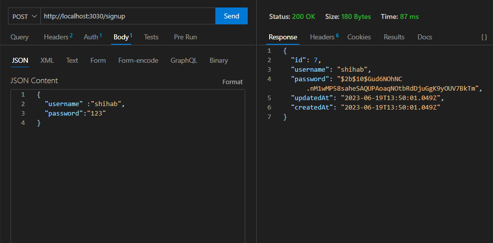
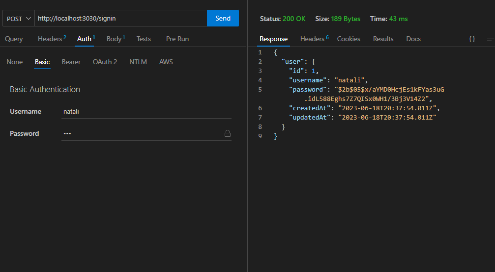

# basic-auth
deployment URL: https://basicauth-rcur.onrender.com
### UML :

#### i have 4 tests :
1. 404 on a bad route.
2. 404 on a bad method.
3. POST to /signup to create a new user.
4. POST to /signin to login as a user (use basic auth).

## jest testing:

___________________________________________________________________________________________________________
## manual testing:

___________________________________________________________________________________________________________
