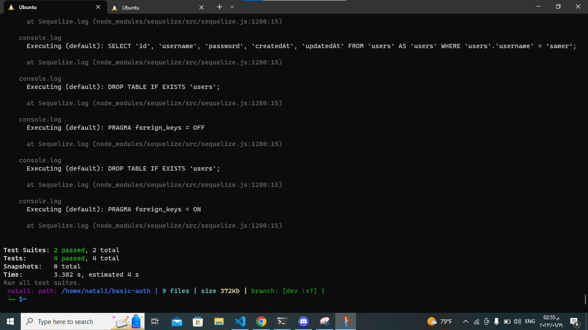

# basic-auth
#### i have 4 tests :

tow tests in[404.test.js file:](./src/auth/handlers/404.test.js)
1. 404 on a bad route.
2. should return 404 on a bad method.

tow tests in [server.test.js:](./__test__/server.test.js)

3. POST to /signup to create a new user.
4. POST to /signin to login as a user (use basic auth).

